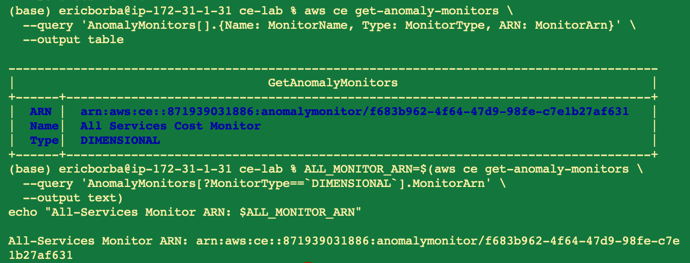
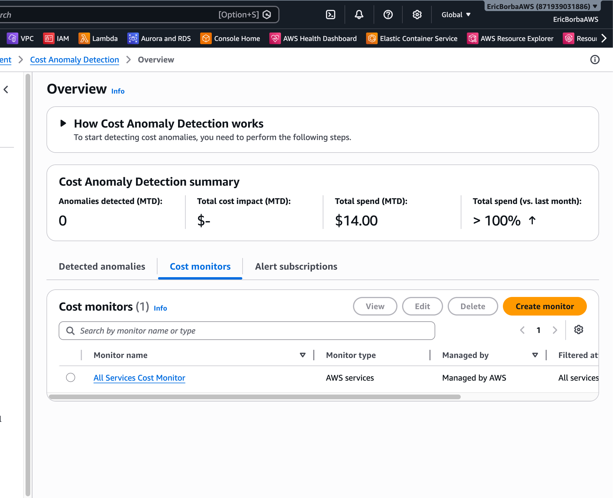
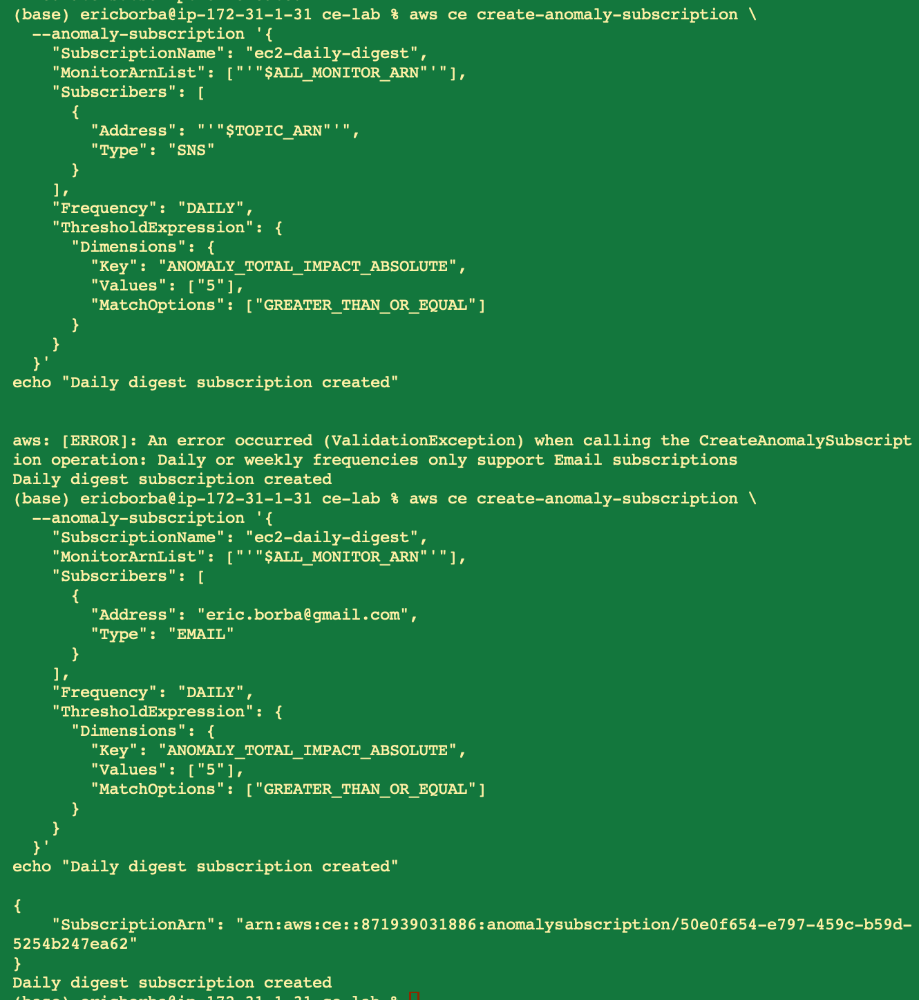
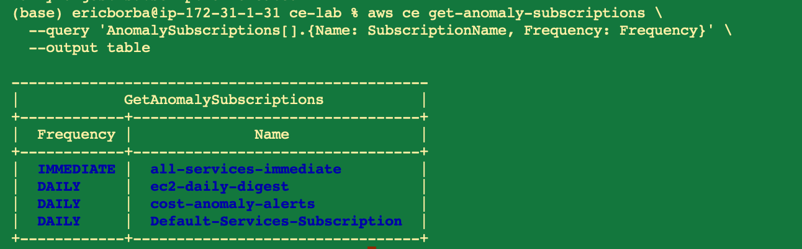
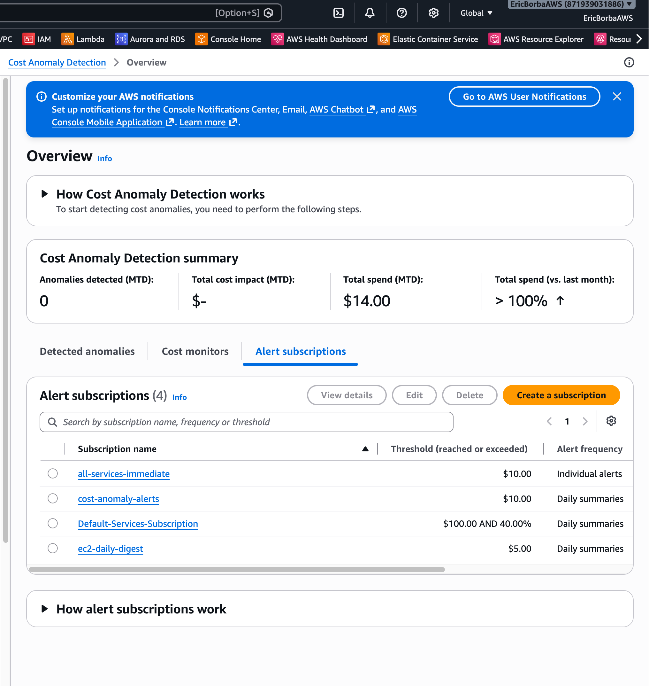
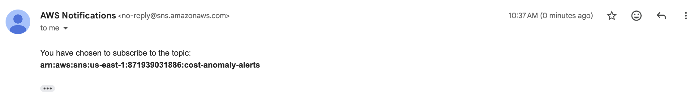
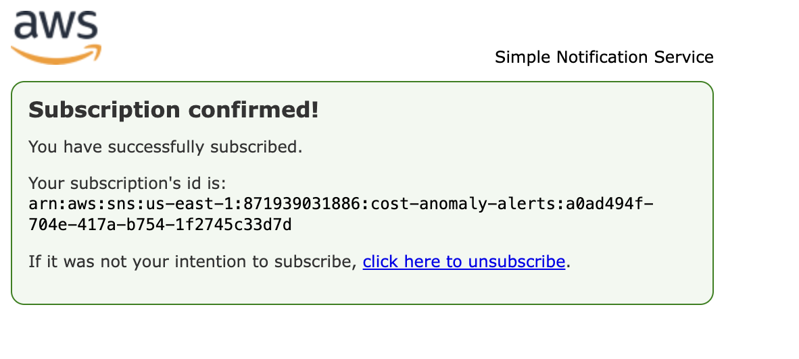
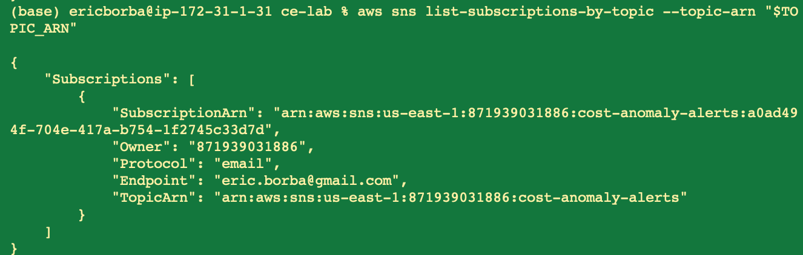
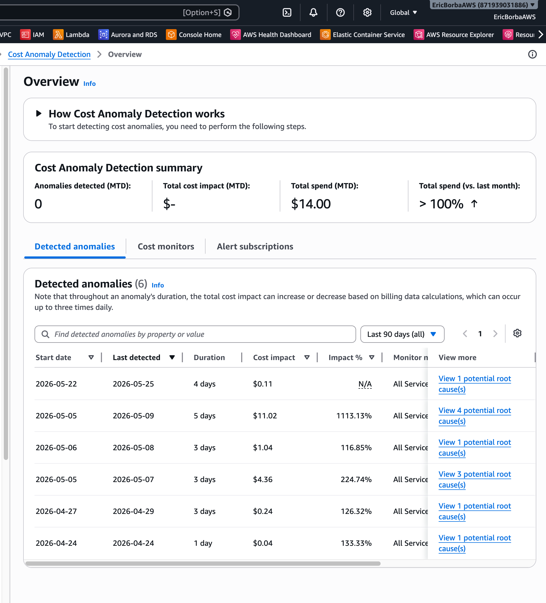

# Lab M7.06 - Cost Anomaly Detection Setup


## What I Did

- Created an SNS topic (`cost-anomaly-alerts`) with confirmed email subscription for anomaly notifications
- Reused the existing DIMENSIONAL anomaly monitor (`All Services Cost Monitor`) which builds separate ML models per AWS service
- Attempted to create an EC2-scoped CUSTOM monitor — documented why it's not possible in a single-account setup without AWS Organizations
- Created two anomaly subscriptions: `all-services-immediate` (IMMEDIATE, $10 threshold via SNS) and `ec2-daily-digest` (DAILY, $5 threshold via direct email)
- Discovered and documented that DAILY/WEEKLY subscriptions only support direct email — not SNS topics
- Demonstrated subscription frequency updates (DAILY → WEEKLY → DAILY)
- Documented the full alert flow and built a structured incident response runbook

## Architecture

```
AWS Cost Anomaly Detection (ML — separate model per service)
  │
  └── All Services Cost Monitor (DIMENSIONAL)
        │
        ├── all-services-immediate ($10+) → SNS → Email
        └── ec2-daily-digest ($5+)        → Direct Email (daily digest)
```

## Anomaly Monitor

| Monitor | Type | Scope | Status |
|---------|------|-------|--------|
| All Services Cost Monitor | DIMENSIONAL | All AWS services | Pre-existing, reused |
| ec2-cost-monitor | CUSTOM | EC2 only | Not possible — see notes |

### Why the EC2-Scoped Monitor Wasn't Created

AWS Cost Anomaly Detection CUSTOM monitors require a `LINKED_ACCOUNT` dimension — they are designed for **AWS Organizations** where a management account monitors individual member (linked) accounts. In a single-account setup:

- `SERVICE` dimension is rejected: *"Dimension not valid; must be scoped to LINKED_ACCOUNT"*
- Using your own account ID as `LINKED_ACCOUNT` creates a monitor with identical scope to the DIMENSIONAL one — no added value

The DIMENSIONAL monitor already trains separate ML models per service (including EC2), so EC2 anomalies are still detected and identified in notification payloads. True EC2-only subscription filtering would require a Lambda function to inspect the anomaly payload and route accordingly.




## Subscriptions

| Subscription | Frequency | Threshold | Subscriber Type | Channel |
|-------------|-----------|-----------|-----------------|---------|
| all-services-immediate | IMMEDIATE | ≥ $10 | SNS | Email via SNS topic |
| ec2-daily-digest | DAILY | ≥ $5 | EMAIL | Direct email digest |

### Frequency vs. Subscriber Type Constraint

AWS enforces that `DAILY` and `WEEKLY` subscriptions can only use direct email addresses — SNS topics are only supported for `IMMEDIATE` alerts.





## SNS Subscription Confirmed





## Anomaly History

The account already has 6 detected anomalies in the last 90 days — the ML model is trained and active.



## Key Findings

- Cost Anomaly Detection uses ML to learn spending baselines — it catches gradual drift and one-off spikes that static budget alerts miss
- AWS allows only **one DIMENSIONAL monitor per account** — it automatically creates per-service models
- CUSTOM monitors require AWS Organizations — they cannot be scoped to a specific service in a single account
- DAILY/WEEKLY subscriptions must use direct email, not SNS — this limits downstream automation for non-immediate alerts
- Threshold expressions prevent alert fatigue — only anomalies above a dollar floor trigger notifications

## Files

| File | Description |
|------|-------------|
| [alert-flow.md](alert-flow.md) | End-to-end alert flow, monitor limitations, frequency comparison |
| [runbook.md](runbook.md) | Incident response runbook with severity levels and investigation commands |
| [cli-commands.md](cli-commands.md) | All CLI commands executed including failed attempts and fixes |
